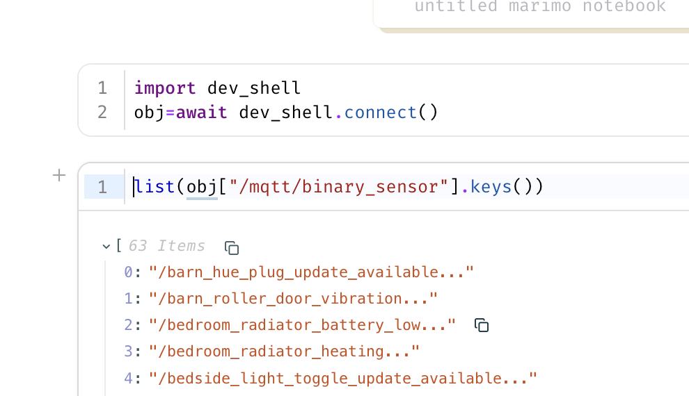

# Alternative Integration

Other ways of using Home Assistant REPL without using the supplied shell.

## Using `homeassistant_repl` from Plain Python

The `api` mode REPL above is just a thin wrapper around `homeassistant_repl.connect()` - the same call works from a one-off script, a notebook, or an interactive `python -m asyncio` session (the standard library's REPL that supports top-level `await`, unlike plain `python`), with no dependency on the `ha-repl` executable at all.

Install the package first (`pip install homeassistant-repl`, or `uv add homeassistant-repl` in a project) - the importable package is named `homeassistant_repl`.

```bash
$ python -m asyncio
>>> import homeassistant_repl
>>> obj = await homeassistant_repl.connect()  # reads $HASS_SERVER/$HASS_TOKEN, same as the CLI
>>> obj["/rflink/binary_sensor/hall_pir"].state
'off'
>>> [e.entity_id for e in obj.find(domain="light")]
['light.kitchen_lights', 'light.shed']
```

Or pass the URL/token explicitly rather than via environment variables, and use it in a script with `asyncio.run`:

```python
import asyncio
import homeassistant_repl


async def main() -> None:
    obj = await homeassistant_repl.connect(
        url="http://homeassistant.local:8123", token="..."
    )
    print(obj["/rflink/binary_sensor/hall_pir"].state)


asyncio.run(main())
```

`obj` behaves identically to the one bound in the REPL - everything under The Object Tree below applies. `connect()` only gets you `api` mode (read-only, no `hass`); `live` mode's live object tree requires the `ha_repl_server` HACS component and talks to it over the same underlying `Client`, but isn't exposed as a standalone importable helper.

`connect()` reads the same [`config.toml`](client_configuration.md) as the CLI, so a server can be given by name - `await homeassistant_repl.connect("house")` - and the `default` server is used when no argument and no `HASS_SERVER` is given. Plugins belong to the shells, and are not run by `connect()`.

By default the cached snapshot is reused for 30 seconds (`ttl=` to change that) and the websocket connection is left open for the life of the process; call `await obj.cache.refresh()` for a fresh snapshot on demand, or `await obj.cache.client.close()` when you're done with it if that matters for your script.

## iPython Example

```bash
$ ipython
>>> import homeassistant_repl
>>> obj = await homeassistant_repl.connect()
```

## Marimo Example

{width=500}

## Web Based Terminal

[ttyd](https://tsl0922.github.io/ttyd/) is available easily via Mise, Homebrew or `opkg`. The http port will be logged at startup. It can be a dangerous security hole if not carefully used.

```bash
ttyd uv run --with homeassistant-repl ha-repl api
```

Recent versions of ttyd are read-only unless started with `--writable`, and have no login unless given `--credential user:password`. Anyone who can reach the port can use the shell, and in `live` mode that means running any Python inside Home Assistant.

### In a Docker Container

This example image serves the live shell on port 7681, for where installing ttyd and `uv` directly isn't convenient. It hasn't been widely tested, so treat it as a starting point.

```dockerfile
FROM ghcr.io/astral-sh/uv:python3.14-bookworm-slim

RUN apt-get update \
    && apt-get install -y --no-install-recommends ttyd \
    && rm -rf /var/lib/apt/lists/*

# installs the ha-repl command into /usr/local/bin
ENV UV_TOOL_BIN_DIR=/usr/local/bin
RUN uv tool install homeassistant-repl

EXPOSE 7681
CMD ["ttyd", "--writable", "--port", "7681", "ha-repl", "live"]
```

Build it, then run it with the address and token of the Home Assistant to connect to, published only on the local machine:

```bash
docker build -t ha-repl-web .
docker run --rm -p 127.0.0.1:7681:7681 \
    -e HASS_SERVER=http://homeassistant.local:8123 \
    -e HASS_TOKEN=<long lived access token> \
    ha-repl-web
```

The shell is then at <http://localhost:7681>. To set a login, or run `api` mode instead, give the whole command at the end of `docker run`, for example `ttyd --writable --credential me:secret ha-repl live`.

## From a Home Assistant Terminal Add-on

On Home Assistant OS there is no `uv`, or recent enough Python, on the host - but a terminal add-on runs in its own container, where both can be added. This gives a shell in the browser, from the Home Assistant sidebar, with nothing to install on another machine.

With the [Advanced SSH & Web Terminal](https://github.com/hassio-addons/addon-ssh) add-on, add `uv` to the packages it installs each time it starts, in the add-on's configuration:

```yaml
packages:
  - uv
```

Restart the add-on, open its terminal, and run the shell - `uv` downloads a suitable Python of its own:

```bash
uvx --from homeassistant-repl ha-repl live
```

No `HASS_SERVER` or `HASS_TOKEN` is needed if the add-on provides a `SUPERVISOR_TOKEN`, since `ha-repl` then connects through the Supervisor. Otherwise set both, as for any other machine.

`uv` keeps its downloads in the home directory, which the add-on may not keep between restarts. To avoid downloading Python and the packages again each time, point `UV_CACHE_DIR` and `UV_PYTHON_INSTALL_DIR` at a directory that is kept, such as one under `/config`.

### Studio Code Server

The [Studio Code Server](https://github.com/hassio-addons/addon-vscode) add-on also works, from its built-in terminal, with two differences. It is based on Debian, which has no `uv` package to add to the configuration, so install `uv` with its own installer:

```bash
curl -LsSf https://astral.sh/uv/install.sh | sh
```

Its Python is also older than `ha-repl` needs, so ask `uv` for a newer one when running the shell:

```bash
uv run --python 3.14 --with homeassistant-repl ha-repl live
```

To have `uv` there each time the add-on starts, put the install command in the add-on's `init_commands` configuration.
