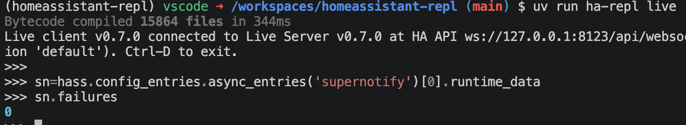

# Live Mode

Live mode is the most powerful, flexible and dangerous way to play around with Home Assistant. Use it with a devcontainer Home Assistant or development instance unless you really know what you're doing, and even then ...

## Installation

Install via [HACS](https://hacs.xyz):

 - it's not in the default HACS repository, so you'll have to add `https://github.com/rhizomatics/homeassistant-repl` as a Custom Repository from the top-right dot menu first
 - Search for *Home Assistant REPL* in the HACS menu and choose *Download*
 - Restart Home Assistant for it to recognize the new custom component available
 - From **Settings → Devices & services → Add integration** find **Home Assistant REPL Server** in the list and install, there's no further config needed
   - The component will quiz you first to make sure you know what you're doing
   - Alternatively add `ha_repl_server:` to `configuration.yaml`, which is imported as a config entry) 

## Using the Live REPL



Run `ha-repl` with the `live` argument

The quickest way to run the shell is using *uv*, which you can do without cloning this repo or making any other downloads.

```bash
uv run --with homeassistant-repl ha-repl live     
```

Once you're in, `hass` gives you direct access to the running instance of the [HomeAssistant](https://developers.home-assistant.io/docs/dev_101_hass) class, from which everything else is accessible, its the ultimate god object for the platform.

Also, `sql` gives you query access to the primary HomeAssistant database.

Get help on the arguments in the usual way.


## Running from a clone/fork of this repo

If you do have this repo checked out, you can also use a direct `run` which means you can also tinker locally with `homeassistant_repl` code.

```bash
uv run ha-repl         
```

### Install Local Home Assistant with the Live Server

The `homeassistant-repl` repo has a [DevContainer](https://containers.dev) defined, and helper scripts in the `/dev` directory to manage it.

Dev instance (devcontainer, or directly on a host with Python 3.14):

```sh
dev/setup.sh                 # installs HA into its own venv + the CLI (devcontainer runs this)
dev/restart-ha.sh            # Kill current HA instance and start a new
dev/run-ha.sh                # HA on :8123 with custom_components/ha_repl_server symlinked in
uv run python dev/bootstrap.py   # onboard (user dev/dev) and write dev/.env with a token
```

Using it (host or container):

```sh
set -a; . dev/.env; set +a
uv run ha-repl                                         # interactive
uv run ha-repl exec 'hass.states.get("sun.sun")'
uv run ha-repl exec - <<'PY'
await hass.services.async_call("light", "toggle", {"entity_id": "light.kitchen_lights"}, blocking=True)
hass.states.get("light.kitchen_lights").state
PY
```
