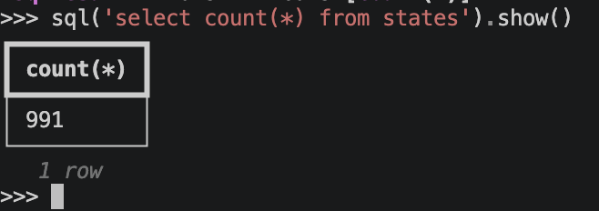

# SQL Access

Home Assistant has an internal SQL database front-ended by the [Recorder](https://www.home-assistant.io/integrations/recorder/) integration. It holds, history, activity, long term statistics and more. Underneath it can by Sqlite (most common), MariaDB, MySQL or PostgreSQL.

When in `live` mode, the `ha-cli` exposes an `sql` variable, which allows access to this database, via the Recorder interface. 

`sql` and its results are local objects. A query is sent to Home Assistant, the rows come back as one download, and everything after that - `show()`, slicing, dataframes, CSV export - works on that local copy, with whatever libraries you have installed locally. Nothing extra needs installing in Home Assistant.

!!! info 
    Data is serialized as Apache Arrow using the `nanofeather` library - this provides column-oriented data for good compression, zero-copy reuse into dataframes and good compatibility with popular data libraries like `polars` and `pandas`.

### `sql` Object

| Operation | Description |
| --------- | ----------- |
| `sql("<query>")` | Send a query to the database and wait for results |
| `sql.max_rows` | Read/write property to set the default row limit for results in this session |
| `sql.tables` | Returns a list of `Table` objects that describe each table and its contents |

For example this will show the size of the `statistics` table.

```python
>>> results=sql('select * from event_types')
>>> sql('select count(*) from statistics').show()
```



### Result Objects

On the result object, `show()` will display data in tabular form at the command, using the `rich` library's table support. 

The result will have both its rows and columns automatically limited, so it doesn't look like a mess or lock up the console. Use `max_rows` or `max_cols` to override this, or `columns` to set the list of columns specifically.

The results can also be sliced like a Python list, so `[:10]` for the first 10 rows or `[-10:]` for the last 10. You can also call `len()` on the results to get the number of rows.

| Operation.     | Description        |
| -------------- | ------------------ |
| `rowcount`     | Size of result set, may not be size of table due to row limits |
| `truncated`    | `True` if results were truncated due to row limits |
| `table`        | The `Table` object describing this table, or `None` if the columns don't identify a single table |
| `columns`      | The data itself: a `dict` of Arrow arrays, one per column, by name |
| `column_names` | List of the column names in the table, in order |
| `show()`       | Dump the table data to the console |
| `project()`    | Create a new result object with a limited set of columns based on this one |
| `sample()`     | Randomly sample selected quantity of rows out of the result set |
| `export_csv()` | Write the results to a local CSV file, by default named after the table (`result.csv` if there isn't one) |
| `arrow()`      | Raw Arrow data |
| `to_dicts()`   | Extract a `list` of `dict` objects from the results |
| `to_pandas()`  | Turn the results into a *pandas* dataframe, if pandas installed |
| `to_polars()`  | Turn the results into a *polars* dataframe, if polars installed |

### Table Objects

On the `Table` object, call `columns()` or `column_names()` to learn more about the structure.

### More Help

Use `help(sql)` or call `help(..)` on a result object to get reminded of the API.
